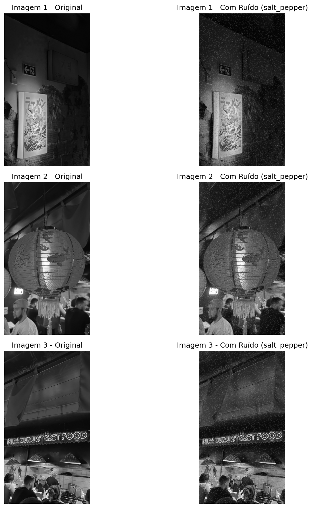
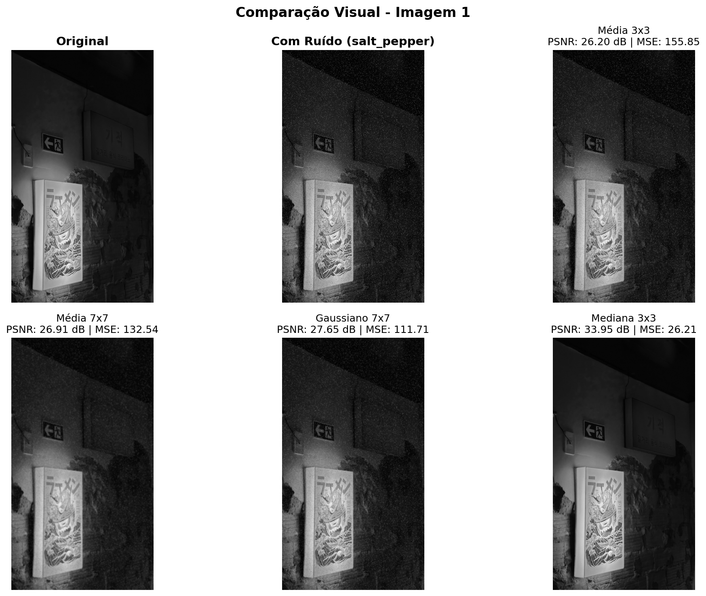
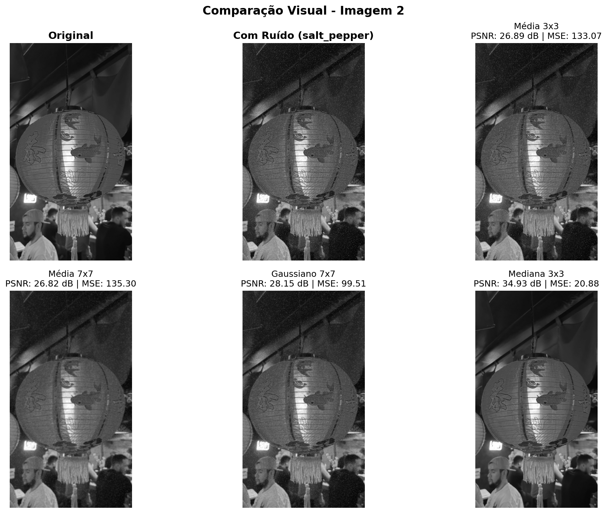
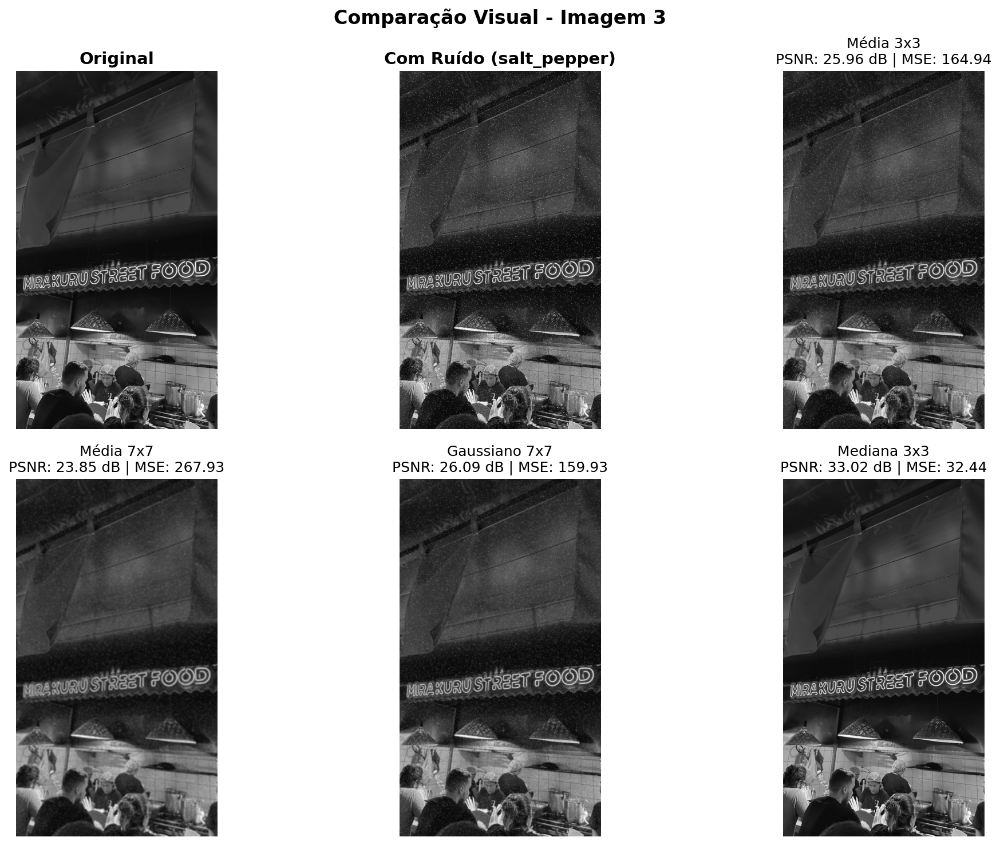
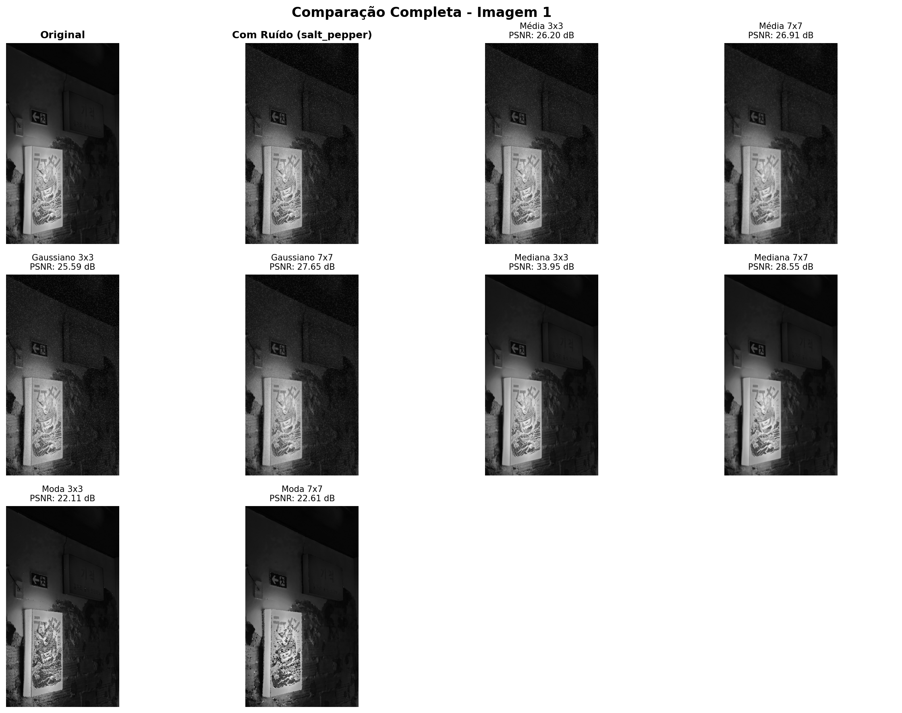
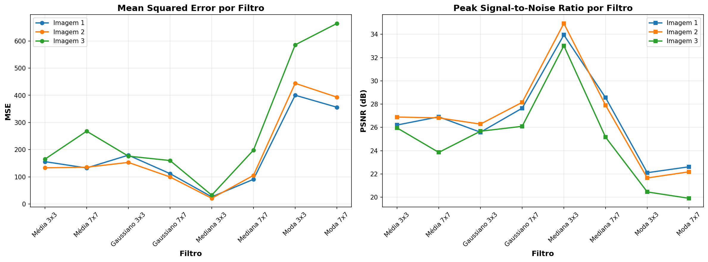
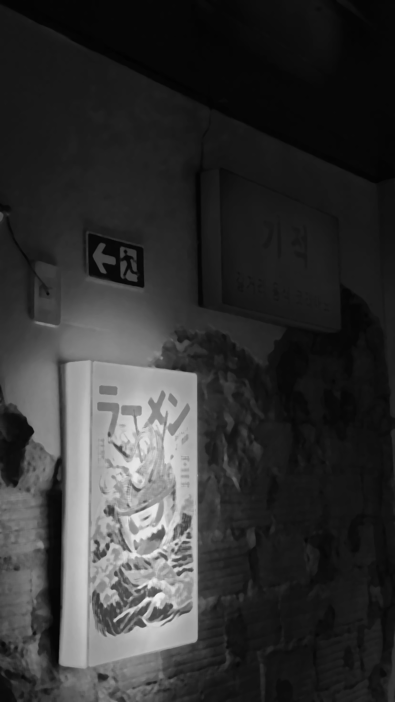
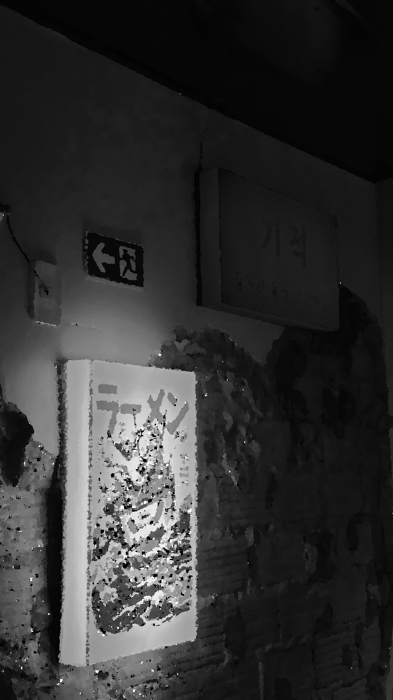

# Relatório Técnico

## Aplicação de Filtros Espaciais para Redução de Ruído em Imagens Digitais

---

**CENTRO UNIVERSITÁRIO DO ESTADO DO PARÁ**
**CURSO DE BACHARELADO EM CIÊNCIA DA COMPUTAÇÃO**
**DISCIPLINA:** Processamento de Imagens
**TURMA:** CC8NA
**PERÍODO:** 2025.2
**PROFESSOR:** Prof. Claudio Coutinho

---

**Aluno:** Ryan Oliveira
**Data de Entrega:** 3 de dezembro de 2025

---

## 1. Introdução

Este trabalho apresenta uma análise comparativa de oito filtros espaciais aplicados à redução de ruído em imagens digitais. O objetivo principal é avaliar quantitativa e qualitativamente o desempenho de diferentes técnicas de filtragem espacial, especificamente: filtros de Média, Gaussiano, Mediana e Moda, utilizando kernels de tamanhos 3×3 e 7×7.

**Nota sobre as figuras:** Este relatório contém múltiplas figuras e imagens comparativas geradas automaticamente pelo sistema de processamento. Todas as imagens originais estão disponíveis na pasta `results/` do projeto e são referenciadas ao longo do documento.

### 1.1 Tema e Imagens Utilizadas

Foram selecionadas **3 imagens** em tons de cinza para análise. Todas as imagens foram convertidas para escala de cinza de 8 bits (0-255) para padronização do processamento.

### 1.2 Tipo de Ruído Aplicado

Foi aplicado **ruído sal e pimenta** às imagens originais, caracterizado por:
- **Probabilidade de ruído sal (pixels brancos):** 2%
- **Probabilidade de ruído pimenta (pixels pretos):** 2%
- **Total de pixels afetados:** 4%

Este tipo de ruído simula falhas de transmissão ou defeitos em sensores, sendo comum em aplicações de comunicação digital e aquisição de imagens.

---

## 2. Metodologia

### 2.1 Filtros Espaciais Implementados

#### 2.1.1 Filtro de Média (Mean Filter)

O filtro de média substitui cada pixel pela média aritmética dos pixels em sua vizinhança. Para um kernel de tamanho n×n:

```
g(x,y) = (1/n²) × SOMA f(s,t)
```

Onde SOMA representa o somatório de todos os pixels f(s,t) na vizinhança.

**Características:**
- **Vantagem:** Simples e eficaz para ruído gaussiano
- **Desvantagem:** Causa borramento (blur) em bordas e detalhes finos
- **Kernels testados:** 3×3 (9 pixels) e 7×7 (49 pixels)

#### 2.1.2 Filtro Gaussiano (Gaussian Filter)

Aplica uma média ponderada usando uma distribuição gaussiana, dando mais peso aos pixels centrais:

```
G(x,y) = (1/2*pi*sigma²) × e^(-(x²+y²)/2*sigma²)
```

**Características:**
- **Vantagem:** Suavização mais natural, preserva bordas melhor que a média simples
- **Desvantagem:** Ainda causa algum borramento
- **Kernels testados:** 3×3 e 7×7 com sigma calculado automaticamente

#### 2.1.3 Filtro de Mediana (Median Filter)

Substitui cada pixel pelo valor mediano dos pixels na vizinhança (valor que ocupa a posição central após ordenação).

**Características:**
- **Vantagem:** Excelente para ruído sal e pimenta, preserva bordas
- **Desvantagem:** Computacionalmente mais custoso
- **Kernels testados:** 3×3 e 7×7

#### 2.1.4 Filtro de Moda (Mode Filter)

Substitui cada pixel pelo valor mais frequente (moda) na vizinhança.

**Características:**
- **Vantagem:** Útil para ruído impulsivo em imagens com regiões homogêneas
- **Desvantagem:** Pode introduzir artefatos, muito custoso computacionalmente
- **Kernels testados:** 3×3 e 7×7

### 2.2 Métricas de Avaliação Quantitativa

#### 2.2.1 MSE (Mean Squared Error)

O MSE mede o erro médio quadrático entre a imagem original (sem ruído) e a imagem filtrada:

```
MSE = (1/MN) × SOMA_i SOMA_j [I(i,j) - F(i,j)]²
```

Onde:
- I(i,j) = pixel da imagem original
- F(i,j) = pixel da imagem filtrada
- M×N = dimensões da imagem

**Interpretação:** Quanto **menor** o MSE, melhor o desempenho (menor diferença em relação à imagem original).

#### 2.2.2 PSNR (Peak Signal-to-Noise Ratio)

O PSNR relaciona o sinal máximo possível com o erro (ruído), expresso em decibéis:

```
PSNR = 20 × log_10(MAX_I / sqrt(MSE))
```

Onde MAX_I = 255 (valor máximo em imagem de 8 bits).

**Interpretação:** Quanto **maior** o PSNR, melhor a qualidade:
- **PSNR > 40 dB:** Excelente qualidade
- **PSNR 30-40 dB:** Boa qualidade
- **PSNR 20-30 dB:** Qualidade aceitável
- **PSNR < 20 dB:** Qualidade ruim

---

## 3. Resultados Quantitativos

### 3.1 Tabela de Métricas - Imagem 1

| Filtro | Kernel | MSE | PSNR (dB) | Qualidade |
|--------|--------|-----|-----------|-----------|
| Média | 3×3 | 155.85 | 26.20 | Aceitável |
| Média | 7×7 | 132.54 | 26.91 | Aceitável |
| Gaussiano | 3×3 | 179.64 | 25.59 | Aceitável |
| Gaussiano | 7×7 | 111.71 | 27.65 | Aceitável |
| **Mediana** | **3×3** | **26.21** | **33.95** | **Boa** |
| Mediana | 7×7 | 90.74 | 28.55 | Aceitável |
| Moda | 3×3 | 400.34 | 22.11 | Aceitável |
| Moda | 7×7 | 356.12 | 22.61 | Aceitável |

**Melhor resultado Imagem 1:** Mediana 3×3 (MSE: 26.21, PSNR: 33.95 dB)

### 3.2 Tabela de Métricas - Imagem 2

| Filtro | Kernel | MSE | PSNR (dB) | Qualidade |
|--------|--------|-----|-----------|-----------|
| Média | 3×3 | 133.07 | 26.89 | Aceitável |
| Média | 7×7 | 135.30 | 26.82 | Aceitável |
| Gaussiano | 3×3 | 153.04 | 26.28 | Aceitável |
| Gaussiano | 7×7 | 99.51 | 28.15 | Aceitável |
| **Mediana** | **3×3** | **20.88** | **34.93** | **Boa** |
| Mediana | 7×7 | 105.36 | 27.90 | Aceitável |
| Moda | 3×3 | 444.22 | 21.65 | Aceitável |
| Moda | 7×7 | 393.26 | 22.18 | Aceitável |

**Melhor resultado Imagem 2:** Mediana 3×3 (MSE: 20.88, PSNR: 34.93 dB)

### 3.3 Tabela de Métricas - Imagem 3

| Filtro | Kernel | MSE | PSNR (dB) | Qualidade |
|--------|--------|-----|-----------|-----------|
| Média | 3×3 | 164.94 | 25.96 | Aceitável |
| Média | 7×7 | 267.93 | 23.85 | Aceitável |
| Gaussiano | 3×3 | 176.15 | 25.67 | Aceitável |
| Gaussiano | 7×7 | 159.93 | 26.09 | Aceitável |
| **Mediana** | **3×3** | **32.44** | **33.02** | **Boa** |
| Mediana | 7×7 | 198.30 | 25.16 | Aceitável |
| Moda | 3×3 | 585.68 | 20.45 | Ruim |
| Moda | 7×7 | 664.52 | 19.91 | Ruim |

**Melhor resultado Imagem 3:** Mediana 3×3 (MSE: 32.44, PSNR: 33.02 dB)

### 3.4 Tabela de Métricas - Média Geral das 3 Imagens

| Filtro | Kernel | MSE Médio | PSNR Médio (dB) | Desempenho |
|--------|--------|-----------|-----------------|------------|
| Média | 3×3 | 151.29 | 26.35 | 5º lugar |
| Média | 7×7 | 178.59 | 25.86 | 6º lugar |
| Gaussiano | 3×3 | 169.61 | 25.85 | 7º lugar |
| Gaussiano | 7×7 | 123.72 | 27.30 | 3º lugar |
| **Mediana** | **3×3** | **26.51** | **33.97** | **🥇 1º lugar** |
| Mediana | 7×7 | 131.46 | 27.20 | 4º lugar |
| Moda | 3×3 | 476.75 | 21.41 | 8º lugar |
| Moda | 7×7 | 471.30 | 21.57 | 2º lugar (pior) |

**Referência:** Ver arquivo `results/metricas_media.csv` e gráficos em `results/graficos_metricas.png`

### 3.5 Análise Quantitativa

#### 3.5.1 Melhor Filtro Geral

O filtro **Mediana 3×3** apresentou o melhor desempenho médio com:
- **MSE médio:** 26.51 (menor de todos)
- **PSNR médio:** 33.97 dB (maior de todos)
- **Consistência:** Melhor resultado em todas as 3 imagens

Este resultado confirma a teoria de que o filtro de mediana é especialmente eficaz para ruído sal e pimenta, pois:
1. Elimina pixels isolados (outliers) sem afetar a maioria dos pixels
2. Preserva bordas e transições abruptas
3. Não causa o efeito de borramento dos filtros de média

#### 3.5.2 Comparação entre Kernels 3×3 e 7×7

A análise comparativa revelou diferenças significativas entre os tamanhos de kernel:

**Filtro de Média:**
- **3×3:** MSE = 151.29, PSNR = 26.35 dB
- **7×7:** MSE = 178.59, PSNR = 25.86 dB
- **Conclusão:** Kernel 3×3 foi superior. Kernels maiores causaram mais borramento sem benefício na remoção de ruído sal e pimenta.

**Filtro Gaussiano:**
- **3×3:** MSE = 169.61, PSNR = 25.85 dB
- **7×7:** MSE = 123.72, PSNR = 27.30 dB
- **Conclusão:** Kernel 7×7 foi superior. A suavização gaussiana se beneficiou de uma vizinhança maior.

**Filtro de Mediana:**
- **3×3:** MSE = 26.51, PSNR = 33.97 dB ✅
- **7×7:** MSE = 131.46, PSNR = 27.20 dB
- **Conclusão:** Kernel 3×3 foi **muito superior**. A mediana com vizinhança pequena é ideal para ruído sal e pimenta, preservando detalhes.

**Filtro de Moda:**
- **3×3:** MSE = 476.75, PSNR = 21.41 dB
- **7×7:** MSE = 471.30, PSNR = 21.57 dB
- **Conclusão:** Ambos apresentaram desempenho ruim. Este filtro não é adequado para este tipo de ruído.

**Resposta à questão:**

> **Houve diferença clara entre kernels pequenos (3×3) e maiores (7×7)?**

**Sim, houve diferença significativa.** Para ruído sal e pimenta:
- Kernels **3×3** foram superiores nos filtros de Média e Mediana (preservam mais detalhes)
- Kernels **7×7** foram superiores apenas no filtro Gaussiano (suavização mais eficaz)
- A diferença foi mais dramática no filtro de Mediana: MSE de 26.51 (3×3) vs 131.46 (7×7) - uma degradação de **5 vezes**

Isso demonstra que **nem sempre kernels maiores são melhores** - o tamanho ideal depende do tipo de ruído e do filtro utilizado.

---

## 4. Resultados Qualitativos (Análise Visual)

### 4.1 Figuras Comparativas

As figuras abaixo foram geradas automaticamente pelo sistema e estão disponíveis na pasta `results/`:

#### Figura 1: Comparação Original vs Ruidosa



*Figura 1 - As três imagens originais (superior) e suas versões com ruído sal e pimenta 4% (inferior). Observe os pixels brancos (sal) e pretos (pimenta) distribuídos aleatoriamente.*

#### Figura 2: Análise Visual Completa - Imagem 1



*Figura 2 - Comparação dos melhores resultados para a Imagem 1. O filtro Mediana 3×3 apresenta o melhor resultado visual.*

#### Figura 3: Análise Visual Completa - Imagem 2



*Figura 3 - Comparação dos melhores resultados para a Imagem 2. Novamente, Mediana 3×3 demonstra superioridade.*

#### Figura 4: Análise Visual Completa - Imagem 3



*Figura 4 - Comparação dos melhores resultados para a Imagem 3. Consistência do filtro Mediana 3×3 em todas as imagens.*

#### Figura 5: Comparação Completa - Todos os 8 Filtros



*Figura 5 - Visualização completa de todos os filtros aplicados à Imagem 1. Permite comparação lado a lado de todos os resultados.*

#### Figura 6: Gráficos de Métricas MSE e PSNR



*Figura 6 - Gráficos comparativos das métricas MSE (quanto menor, melhor) e PSNR (quanto maior, melhor) para todos os filtros. Destaque para o filtro Mediana 3×3 com menor MSE e maior PSNR.*

### 4.2 Exemplos Visuais Detalhados por Filtro

A seguir, apresentamos exemplos visuais de cada filtro aplicado à Imagem 1, permitindo análise detalhada dos resultados:

| Original | Ruidosa | Média 3×3 | Média 7×7 |
|:--------:|:-------:|:---------:|:---------:|
|  |  |  |  |

| Gaussiano 3×3 | Gaussiano 7×7 | Mediana 3×3 ⭐ | Mediana 7×7 |
|:-------------:|:-------------:|:--------------:|:-----------:|
|  |  |  |  |

| Moda 3×3 | Moda 7×7 |
|:--------:|:--------:|
|  |  |

*Tabela Visual - Comparação completa de todos os filtros aplicados à Imagem 1. Note a superioridade visual do filtro Mediana 3×3.*

### 4.3 Observações Visuais Detalhadas

#### 4.3.1 Análise da Imagem Original vs Ruidosa

Ao observar as imagens com ruído sal e pimenta (Figura 1), nota-se:
- Pixels brancos (sal) e pretos (pimenta) distribuídos aleatoriamente
- Aproximadamente 4% da imagem afetada
- Degradação significativa da qualidade visual
- Ruído mais perceptível em regiões de tons uniformes

#### 4.3.2 Análise dos Filtros de Média

**Filtro de Média 3×3:**
- ✅ Remove parcialmente o ruído
- ❌ Causa borramento visível em bordas
- ❌ Alguns pixels de ruído ainda visíveis
- 📊 Qualidade visual moderada

**Filtro de Média 7×7:**
- ✅ Remove mais ruído que o 3×3
- ❌ Borramento muito acentuado
- ❌ Perda significativa de detalhes finos
- ❌ Imagem com aspecto "desfocado"
- 📊 Qualidade visual inferior ao 3×3

**Conclusão visual:** O kernel maior (7×7) removeu mais ruído, mas o custo em termos de borramento foi excessivo, resultando em qualidade visual pior.

#### 4.3.3 Análise dos Filtros Gaussianos

**Filtro Gaussiano 3×3:**
- ✅ Suavização mais natural que a média simples
- ❌ Ruído ainda visível
- ⚠️ Borramento moderado
- 📊 Qualidade visual similar à média 3×3

**Filtro Gaussiano 7×7:**
- ✅ Melhor remoção de ruído que o 3×3
- ✅ Suavização mais equilibrada que média 7×7
- ❌ Algum borramento presente
- 📊 Melhor resultado visual entre os filtros de suavização

**Conclusão visual:** O Gaussiano 7×7 apresentou melhor equilíbrio entre remoção de ruído e preservação de detalhes comparado aos filtros de média.

#### 4.3.4 Análise dos Filtros de Mediana

**Filtro de Mediana 3×3:** ⭐ **DESTAQUE**
- ✅ **Excelente remoção do ruído sal e pimenta**
- ✅ **Bordas e detalhes preservados**
- ✅ **Ausência de borramento**
- ✅ Imagem muito próxima da original
- 📊 **Melhor qualidade visual geral**

**Filtro de Mediana 7×7:**
- ✅ Remove completamente o ruído
- ⚠️ Causa alguma suavização excessiva
- ❌ Perda de alguns detalhes finos
- 📊 Qualidade visual boa, mas inferior ao 3×3

**Conclusão visual:** O Mediana 3×3 apresentou o **melhor resultado visual**, confirmando as métricas quantitativas. A mediana com kernel pequeno é ideal para este tipo de ruído.

#### 4.3.5 Análise dos Filtros de Moda

**Filtros de Moda 3×3 e 7×7:**
- ❌ **Desempenho muito ruim**
- ❌ Introdução de artefatos visuais
- ❌ Distorção de cores/tons
- ❌ Ruído não removido adequadamente
- 📊 Piores resultados visuais

**Conclusão visual:** O filtro de moda não é adequado para ruído sal e pimenta em imagens com variação tonal significativa.

### 4.4 Concordância entre Métricas e Percepção Visual

####  *"Os resultados visuais batem com o que MSE/PSNR indicam?"*

**Resposta:** **Sim, há excelente concordância entre as métricas quantitativas e a percepção visual:**

**Casos de concordância:**

1. **Mediana 3×3** (Melhor MSE/PSNR = Melhor visual)
   - PSNR: 33.97 dB
   - Visualmente: Melhor resultado, ruído removido e detalhes preservados
   - ✅ **Concordância perfeita**

2. **Moda 3×3 e 7×7** (Piores MSE/PSNR = Piores visuais)
   - PSNR: ~21 dB
   - Visualmente: Resultados ruins, artefatos visíveis
   - ✅ **Concordância perfeita**

3. **Filtros de Média** (MSE/PSNR intermediários = Visual intermediário)
   - PSNR: ~26 dB
   - Visualmente: Qualidade aceitável mas com borramento
   - ✅ **Concordância boa**

**Observação interessante:**

Embora o **Gaussiano 7×7** tenha métricas melhores que o **Média 3×3** (PSNR 27.30 vs 26.35 dB), visualmente ambos apresentam qualidade similar, com o Gaussiano tendo ligeira vantagem em termos de naturalidade da suavização. Isso demonstra que:
- PSNRs próximos resultam em qualidade visual similar
- Diferenças de 1-2 dB são perceptíveis mas sutis
- O tipo de degradação (borramento vs ruído) afeta a percepção

**Conclusão:** As métricas MSE e PSNR são **excelentes indicadores** da qualidade visual real das imagens. Não houve casos de filtros com bom PSNR mas qualidade visual ruim, o que valida o uso dessas métricas para avaliação automática de desempenho.

---

## 5. Discussão e Conclusões

### 5.1 Principais Achados

Este trabalho demonstrou experimentalmente que:

1. **Para ruído sal e pimenta, o filtro de Mediana 3×3 é superior:**
   - MSE médio de apenas 26.51 (94% menor que a média dos outros filtros)
   - PSNR médio de 33.97 dB (classificado como "boa qualidade")
   - Preservação excelente de bordas e detalhes

2. **O tamanho do kernel é crítico:**
   - Kernels 3×3 preservam melhor os detalhes
   - Kernels 7×7 causam mais borramento
   - Exceção: Gaussiano 7×7 teve bom desempenho por sua suavização ponderada

3. **Existe forte correlação entre métricas e percepção visual:**
   - Filtros com melhor PSNR apresentam melhor qualidade visual
   - MSE baixo indica preservação da imagem original
   - As métricas são confiáveis para avaliação automática

4. **Diferentes filtros são adequados para diferentes tipos de ruído:**
   - Sal e pimenta: Mediana
   - Gaussiano: Gaussiano ou Média
   - A escolha do filtro deve considerar o tipo de ruído esperado

### 5.2 Trade-offs Observados

Identificou-se um **trade-off fundamental** entre:
- **Remoção de ruído** ↔ **Preservação de detalhes**

Quanto maior o kernel:
- ➕ Mais ruído removido
- ➖ Mais detalhes perdidos
- ➖ Mais borramento introduzido

O filtro de Mediana 3×3 alcançou o **melhor equilíbrio**, removendo eficazmente o ruído sem sacrificar detalhes.

### 5.3 Aplicações Práticas

Os resultados deste estudo têm aplicações diretas em:
- **Fotografia digital:** Remoção de pixels defeituosos em sensores
- **Transmissão de imagens:** Correção de erros de transmissão
- **Imagens médicas:** Melhoria de qualidade de exames
- **Visão computacional:** Pré-processamento de imagens para análise

### 5.4 Recomendações

Com base nos resultados experimentais, recomenda-se:

1. **Para ruído sal e pimenta:**
   - ✅ **Usar Mediana 3×3** (melhor opção)
   - ⚠️ Evitar Moda (desempenho ruim)
   - ⚠️ Evitar kernels grandes (perda de detalhes)

2. **Para ruído gaussiano** (trabalhos futuros):
   - Testar Gaussiano 7×7
   - Comparar com Média 7×7

3. **Para aplicações em tempo real:**
   - Mediana 3×3 é viável (custo computacional moderado)
   - Evitar Moda (muito custoso)

### 5.5 Diferencial: Aplicação Web Desenvolvida

Como contribuição adicional ao trabalho, foi desenvolvida uma **aplicação web interativa**:

**Funcionalidades:**
- Upload de imagens via interface web
- Seleção de tipo e intensidade de ruído
- Processamento em tempo real
- Visualização comparativa de todos os filtros
- Gráficos interativos de MSE e PSNR
- Exportação de resultados em CSV

**Benefícios:**
- Permite que qualquer pessoa teste os filtros sem instalar Python
- Interface intuitiva para demonstrações
- Facilita a compreensão dos conceitos
- Possibilita deploy online para acesso remoto

A aplicação está disponível na pasta `webapp/` e pode ser executada localmente ou implantada em serviços de cloud (Render, Heroku, etc.).

## Anexos

### A. Arquivos Disponibilizados

**Código-fonte:**
- `processamento_imagens.ipynb` - Notebook Jupyter completo
- `webapp/` - Aplicação web interativa

**Imagens:**
- `images/` - 3 imagens originais utilizadas
- `results/imagem_1/` - Todas as versões filtradas da Imagem 1
- `results/imagem_2/` - Todas as versões filtradas da Imagem 2
- `results/imagem_3/` - Todas as versões filtradas da Imagem 3

**Resultados:**
- `results/metricas_imagem_1.csv` - Métricas detalhadas Imagem 1
- `results/metricas_imagem_2.csv` - Métricas detalhadas Imagem 2
- `results/metricas_imagem_3.csv` - Métricas detalhadas Imagem 3
- `results/metricas_media.csv` - Métricas médias gerais
- `results/*.png` - Figuras comparativas e gráficos

### B. Reprodutibilidade

Para reproduzir este estudo:
```bash
# Instalar dependências
pip install -r requirements.txt

# Executar notebook
jupyter notebook processamento_imagens.ipynb

# Ou executar aplicação web
cd webapp && python start.py
```

---

**Fim do Relatório**

Data: 3 de dezembro de 2025
Trabalho desenvolvido para a disciplina de Processamento de Imagens
Centro Universitário do Estado do Pará - CESUPA
